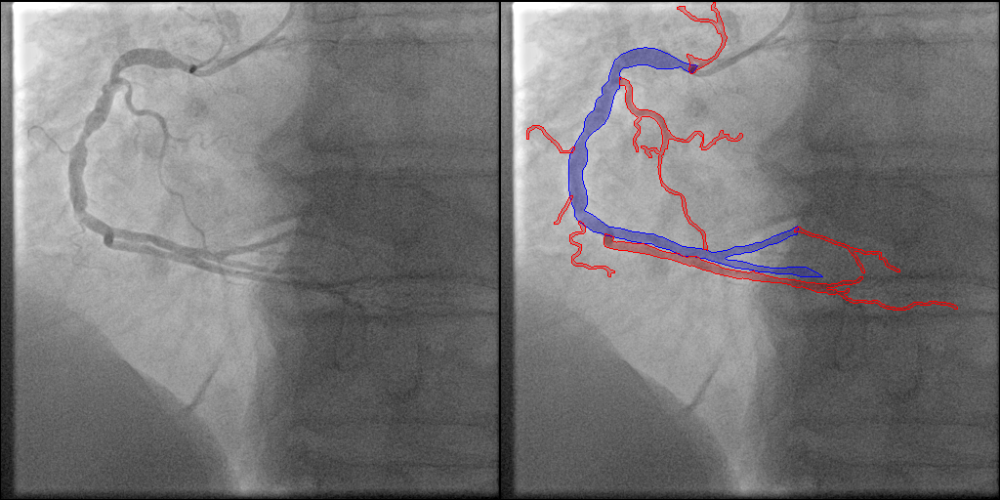
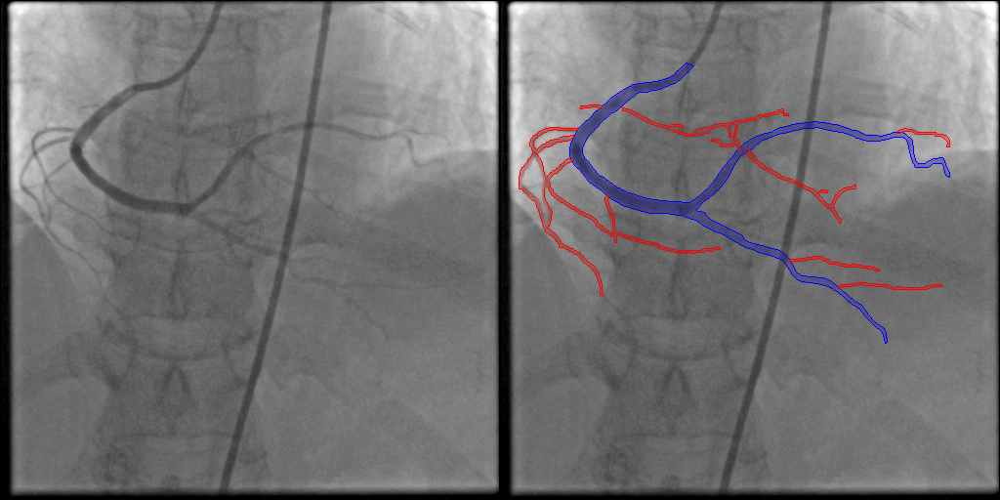
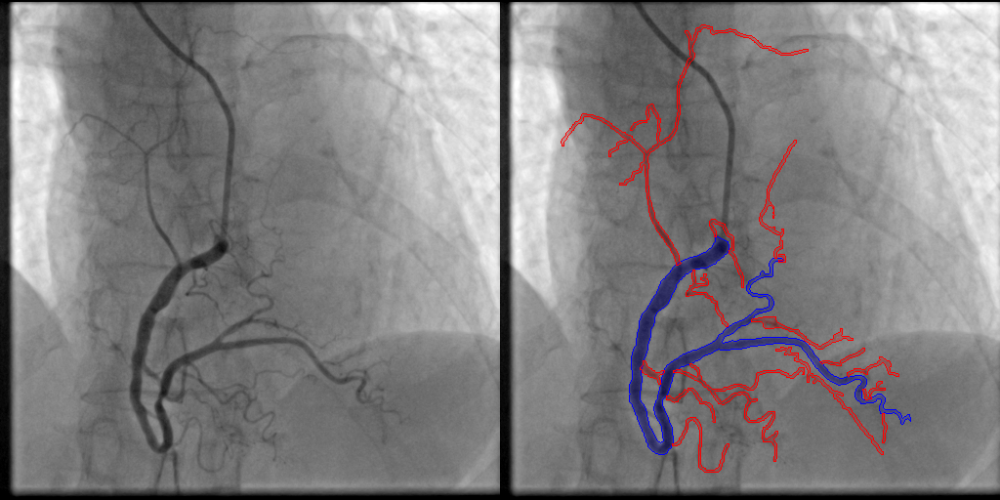
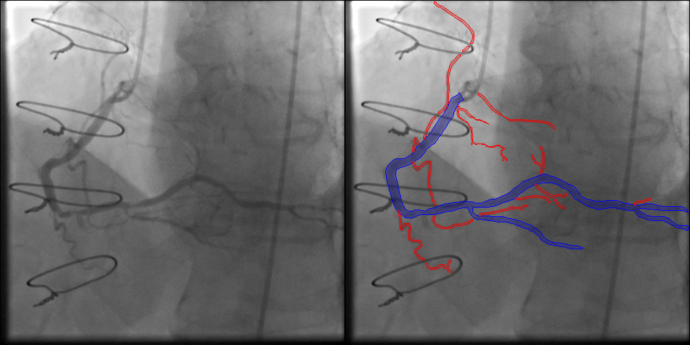

# Installation environment
reference: https://github.com/OpenGVLab/SAM-Med2D.git

```
conda create --name CAGSAM python=3.10 
conda activate CAGSAM
pip install torch==2.6.0 torchvision==0.21.0 torchaudio==2.6.0
pip install -r requirements.txt
```

# Prepare datasets
## Prepare ARCADE from original provider
```
wget 'https://zenodo.org/records/10390295/files/arcade.zip?download=1' -O ./data/ARCADE.zip
cd data
unzip ARCADE.zip
mv arcade ARCADE
cd ..
```

## Preprocess ARCADE/FineARCADE dataset
```
python tools/ARCADE_mask_generation.py
python tools/data_prepare.py
```

## [recommended] Prepare All datasets from Google Drive (XCAD, DCA1, ARCADE, FineARCADE)
```
rm -rf data
gdown 1BJhvi6FzVbbalZR5Fzzfk_2un7NPwkqm -O data.zip
unzip data.zip
```

# Prepare pretrain models for SAM-Med2D
reference: https://github.com/OpenGVLab/SAM-Med2D
```
gdown 1ARiB5RkSsWmAB_8mqWnwDF8ZKTtFwsjl -O pretrain_model/sam-med2d_b.pt
```

# Trian and Evaluation
```
# finetuning only
python train.py --not_augments --data_path data/ARCADE --work_dir work_dir/ft_ARCADE

# finetuning with our augmentation method
python train.py --bg_data_path data/ARCADE --fg_data_path data/ARCADE --fg_num 2 --fg_overlap --fg_min_size 0.50 --fg_max_size 1.00 --work_dir work_dir/aug_ARCADE --test_save_pred
```
- `--data_path`: select train dataset for just finetune
- `--work_dir`: directory to save result
- `--test_save_pred`: save prediction or not
- `--bg_data_path`: select background dataset for augmentation
- `--fg_data_path`: select foreground dataset for augmentation
- `--fg_num`: foreground number
- `--fg_overlap`: overlap foreground mask on background mask or not
- `--fg_min_size`: minimum size for foreground
- `--fg_max_size`: maximum size for foreground

# FineARCADE samples
<span style="color:blue">Blue mask</span> : original label from ARCADE

<span style="color:red">Red mask</span> : ***additional label*** from FineARCADE





